# LR6

Лабораторная работа №6 по дисциплине: " Основы программирования"

## Отчет по лабораторной работе №6
- Тема: Система контроля версий
- Цель лабораторной работы: Изучение базовых возможностей системы управления версиями, опыт работы с Git Api, опыт работы с локальным и
удаленным репозиторием. 

## Порядок выполнения работы
В ходе выполнения работы были выполнены следующие шаги:

### Шаг 1: Создание аккаунта на GitHub
Зарегистрирован аккаунт на сайте GitHub.

### Шаг 2: Форк репозитория
Форкнут репозиторий с заданием: [https://github.com/Kurtyanik/LR6](https://github.com/Kurtyanik/LR6).

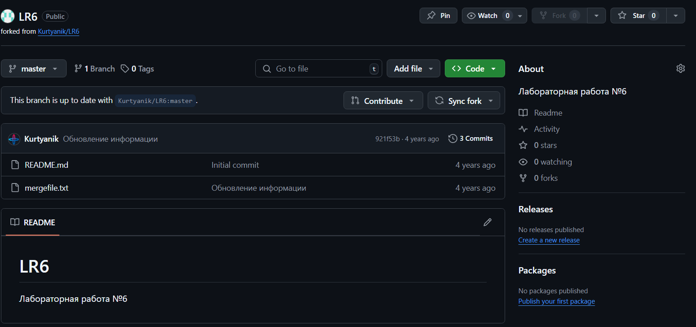

### Шаг 3: Установка Git
Установлен Git с сайта [https://git-scm.com/](https://git-scm.com/).

### Шаг 4: Настройка Git
Настроен клиент Git с помощью следующих команд:

```bash
git config --global user.name "Группа Фамилия И.О."
git config --global user.email "ваш_емейл@example.com"
```
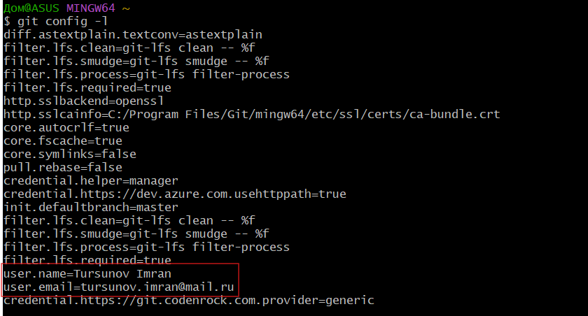

### Шаг 5: Клонирование репозитория

```bash
git clone https://github.com/singl3focus/LR6
```
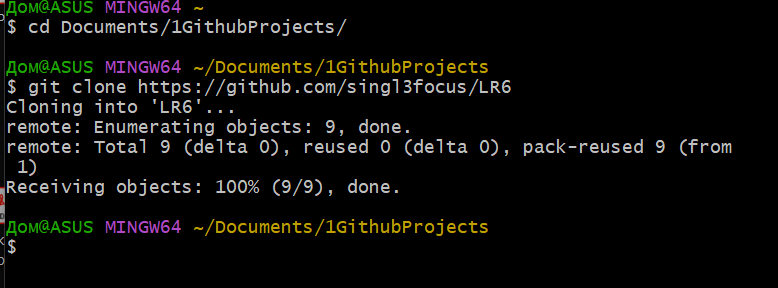

### Шаг 6: Добавление файла через GitHub и подтягивание изменений
Добавлен файл через веб-интерфейс GitHub и изменения подтянуты локально:

```bash
git pull
```
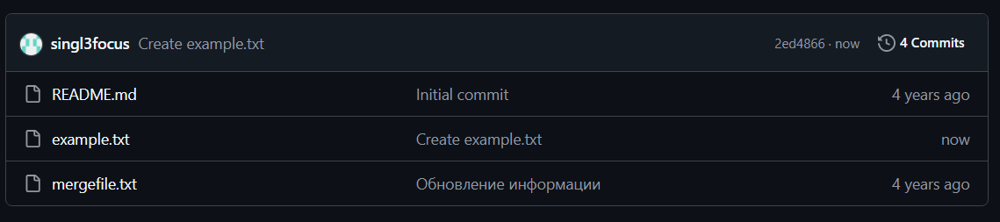
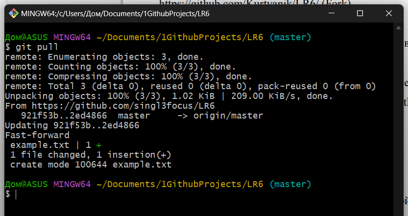

### Шаг 7: Получение истории операций
Получена история операций для каждой ветки:

```bash
git log --oneline --all
```
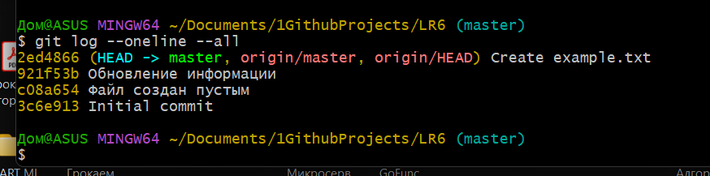

### Шаг 8: Просмотр последних изменений
Посмотрены последние изменения:

```bash
git log -p -1
```
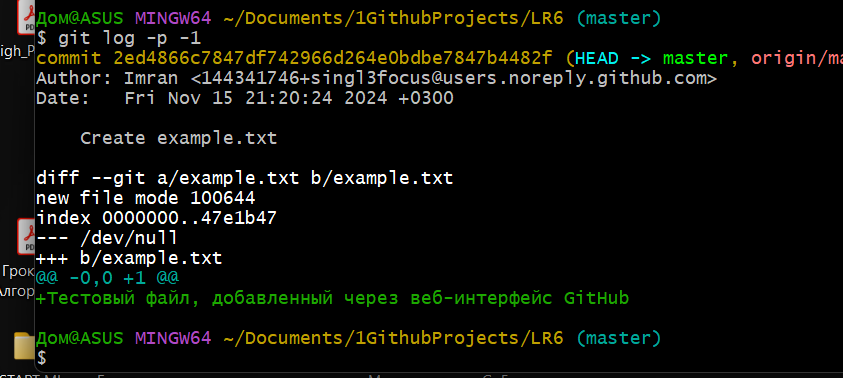

### Шаг 9: Слияние ветки и разрешение конфликта
Создана ветка, внесены изменения, ветка sub слита в master, конфликтов не возникло:

```bash
git branch sub
git checkout sub
# Внесены изменения
git add .
git commit -m "Update example.txt"
git checkout master
git merge sub
```
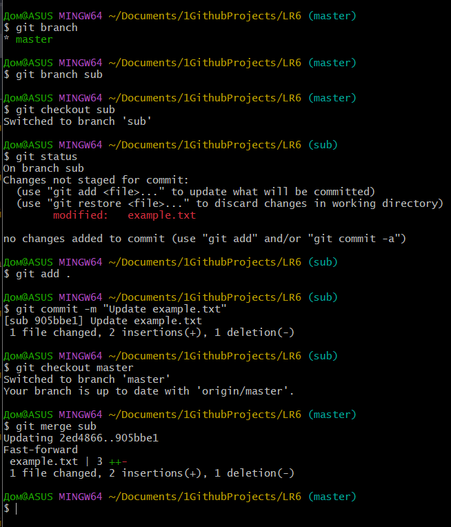

### Шаг 10: Удаление побочной ветки
Удалена ветка sub после слияния:

```bash
git branch -d sub
```

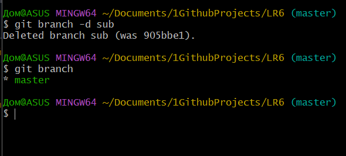

### Шаг 11: Сделаны несколько коммитов с комментариями
Внесены изменения в файл example.txt (поочерёдно добавил две строки) и сделаны коммиты:

```bash
git status
git add example.txt
git commit -m "fix syntax error"
git status
git add example.txt
git commit -m "ref naming"
```
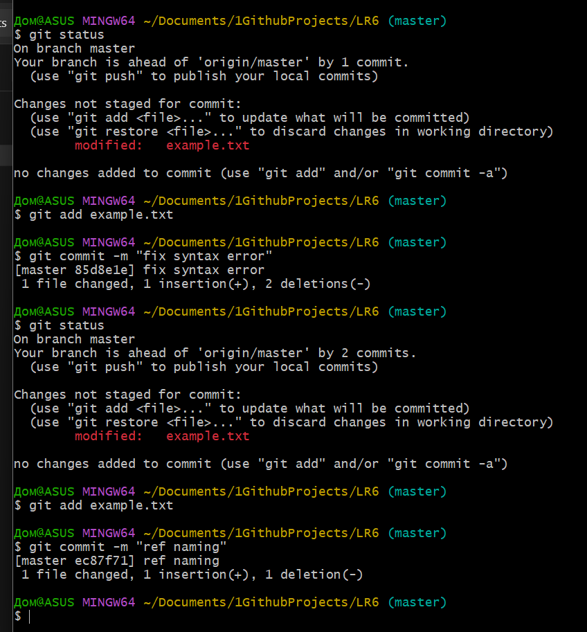

### Шаг 12: Откат коммита
Выполнен откат последнего коммита:

```bash
git log --oneline --all
git revert HEAD
```
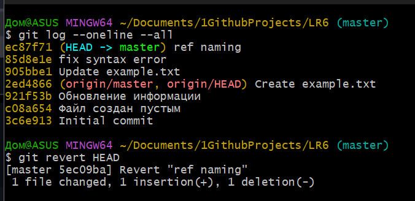


### Шаг 13: Создание ветки для отчета
Создана ветка report для оформления отчета:

```bash
git branch report
git checkout report
```
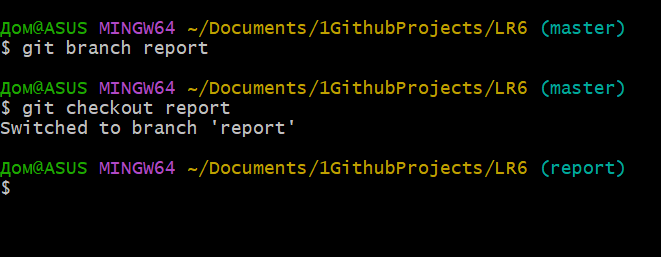

## Лог команд

Данный лог команд описывает весь процесс выполнения лабораторной работы (LR6): настройку Git, получение изменений с GitHub, коммиты, создание веток, слияние, откат коммитов и отправку изменений на GitHub.

```bash
# Настройка имени пользователя и email
git config --global user.name "Tursunov Imran"
git config --global user.email "tursunov.imran@mail.ru"

# Клонирование форкнутого репозитория
# Переключение в директорию проекта
git https://github.com/singl3focus/LR6
cd Documents/1GithubProjects/LR6

# Получение истории операций для всех веток
git log --oneline --all

# Просмотр последних изменений
git log -p -1

# Создание новой ветки
git branch sub

# Переключение на новую ветку
git checkout sub

# Внесение изменений, добавление их в индекс и коммит
git add example.txt
git commit -m "Update example.txt"

# Переключение обратно на мастер и слияние веток
git checkout master
git merge sub

# Удаление побочной ветки после слияния
git branch -d sub

# Создание еще нескольких коммитов с комментариями
git status
git add example.txt
git commit -m "fix syntax error"
git status
git add example.txt
git commit -m "ref naming"

# Откат последнего коммита
git revert HEAD

# Создание ветки для отчета и переключение на нее
git branch report
git checkout report

# Получение истории операций в отформатированном виде
git log --pretty=format:"%h %ad | %s%d [%an]" --date=short

# Отправка изменений на удаленный репозиторий
git push origin report
```

## История операций
Получим и напечатаем историю операций. Сделаем это при помощи команды:

```bash
git log --pretty=format:"%h %ad | %s%d [%an]" --date=short
```
Результат выполнения программы:
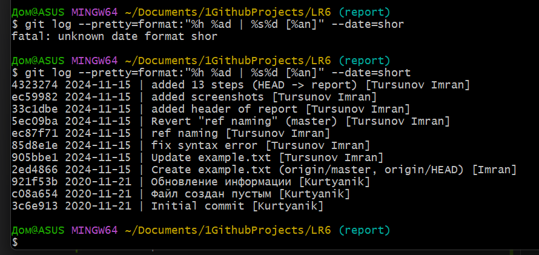

## Вывод
В ходе выполнения лабораторной работы были изучены основные возможности системы контроля версий Git. Получены навыки работы с локальными и удаленными репозиториями, изучен Git Api. создания и слияния веток, разрешения конфликтов и оформления отчета в README.md файле.